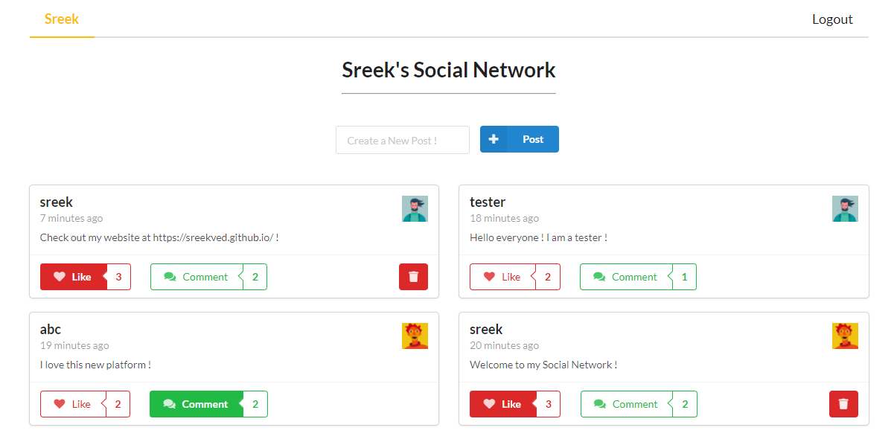
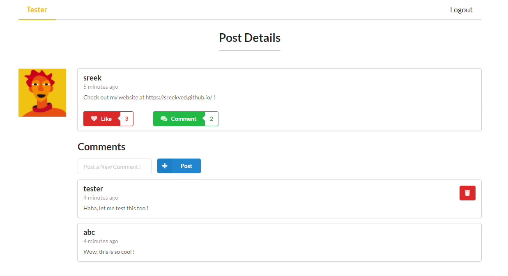
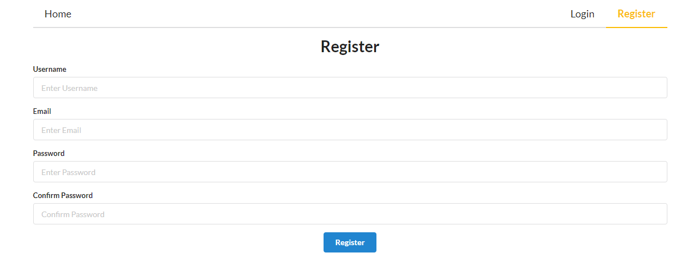

# Social Networking Site

### Try it here ! - [Sreek's Social Network](https://sreek-socialnetwork.herokuapp.com/)

A Social Networking Site with a clean and minimal interface. Users can register or login to create new posts, and can also like or comment on them.

The web front-end interface is built with React.js and Semantic UI, while the back-end uses an Express + Apollo GraphQL Server and MongoDB.

